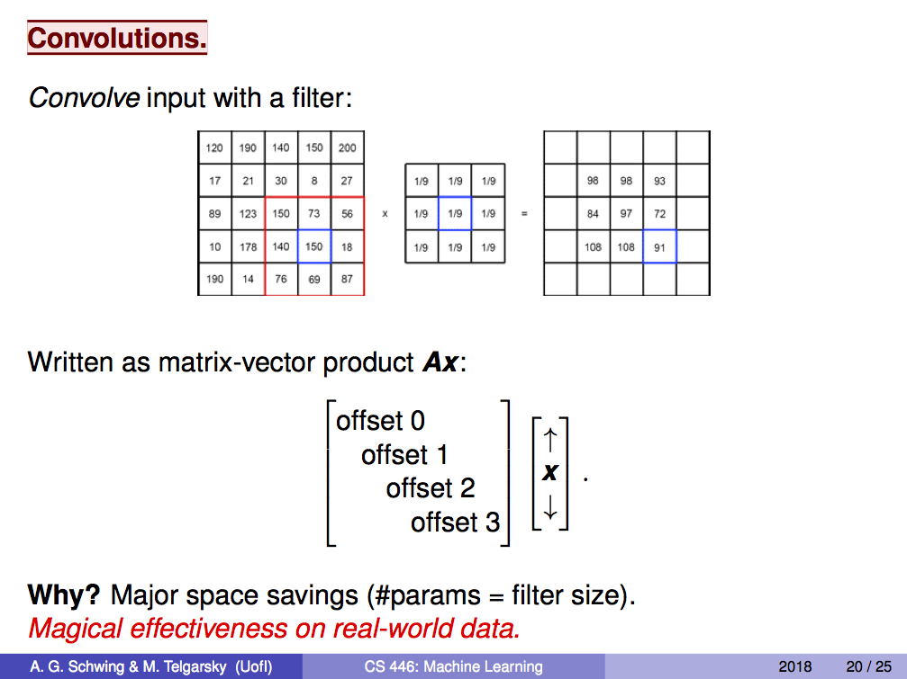

# HW2: Implement and train a convolution neural network from scratch in Python for the MNIST dataset (no PyTorch).

> You should write your own code for convolutions (e.g., do not use SciPy's convolution function). The convolution network should have a single hidden layer with multiple channels.
> 
> It should achieve 97-98% accuracy on the Test Set. For full credit, submit via Compass (1) the code and (2) a paragraph (in a PDF document) which states the Test Accuracy and briefly describes the implementation.
> 
> Due September 14 at 5:00 PM.


## Project files structure

```
.
├── MNISTdata.hdf5
├── README.md
├── fig
│   └── conv.jpg
└── src
    ├── cnn.py    (CNN model file)
    ├── layers.py (different layer definition)
    ├── loss.py   (loss function)
    ├── main.py   (main pipeline)
    ├── optim.py  (Gradient Descent Optimizer)
    └── utils.py  (util funtions)
```


## Implementation

### Hyper-parameters


|   Hyper-parameters  	|    Description    	|
|:-------------------:	|:-----------------:	|
|      lr = 0.01      	|   learning rate   	|
|     epochs = 50     	|  epochs to train  	|
| minibatch_size = 64 	|  input batch size 	|
|    n_filter = 32    	| number of filters 	|
|     h_filter = 7    	|  height of filter 	|
|     w_filter = 7    	|  width of filter  	|
|      stride = 1     	|       stride      	|
|     padding = 1     	|      padding      	|


### Convolution



The idea I implemented convolution is based on the lecture from CS446 in Spring 2018. We can stretch the image, gather all the "locations" which need convolution operations, which is kind of more efficient than just compute convolution on the image. I heavily used the [*"im2col"*](http://cs231n.github.io/assignments2018/assignment2/) util function provided by Stanford CS231n: Convolutional Neural Networks for Visual Recognition course to realize the functionality of efficient and fast convolution operations.


## How to run?

in `src/` directory, copy & paste the following command in terminal:

```sh
python3 main.py
```


## Test Result

- Training on 2500 training images and test on 1000 test images

```
$ python3 main.py
>>> Loading MNIST dataset...
>>> Initialize CNN model ...
>>> Initialize GradientDescentOptimizer ...
>>> Training ...
Epoch 1, Loss = 0.995101785517546, Training Accuracy = 0.4608, Test Accuracy = 0.447
Epoch 2, Loss = 0.1066826900608349, Training Accuracy = 0.9012, Test Accuracy = 0.855
Epoch 3, Loss = 0.08583658228306654, Training Accuracy = 0.9184, Test Accuracy = 0.875
Epoch 4, Loss = 0.06458216967782461, Training Accuracy = 0.9304, Test Accuracy = 0.881
Epoch 5, Loss = 0.05176664593112569, Training Accuracy = 0.9408, Test Accuracy = 0.886
Epoch 6, Loss = 0.04302625247315543, Training Accuracy = 0.9452, Test Accuracy = 0.891
Epoch 7, Loss = 0.03667635814664803, Training Accuracy = 0.9516, Test Accuracy = 0.893
Epoch 8, Loss = 0.031869216037676416, Training Accuracy = 0.9552, Test Accuracy = 0.894
Epoch 9, Loss = 0.028129238311123107, Training Accuracy = 0.958, Test Accuracy = 0.893
Epoch 10, Loss = 0.025159921305122297, Training Accuracy = 0.9616, Test Accuracy = 0.889
Epoch 11, Loss = 0.02275170215319561, Training Accuracy = 0.9648, Test Accuracy = 0.89
Epoch 12, Loss = 0.020766337443705617, Training Accuracy = 0.9676, Test Accuracy = 0.893
Epoch 13, Loss = 0.019109817054261777, Training Accuracy = 0.9696, Test Accuracy = 0.894
Epoch 14, Loss = 0.01770627760673868, Training Accuracy = 0.972, Test Accuracy = 0.897
Epoch 15, Loss = 0.01649805502802392, Training Accuracy = 0.9744, Test Accuracy = 0.899
Epoch 16, Loss = 0.015444624583608459, Training Accuracy = 0.9764, Test Accuracy = 0.901
Epoch 17, Loss = 0.014515656628514773, Training Accuracy = 0.978, Test Accuracy = 0.898
Epoch 18, Loss = 0.01369084784595262, Training Accuracy = 0.9804, Test Accuracy = 0.896
Epoch 19, Loss = 0.01295217931459228, Training Accuracy = 0.9808, Test Accuracy = 0.897
Epoch 20, Loss = 0.012283995391686859, Training Accuracy = 0.9828, Test Accuracy = 0.899
Epoch 21, Loss = 0.011677645984732957, Training Accuracy = 0.9836, Test Accuracy = 0.898
Epoch 22, Loss = 0.01112325950522465, Training Accuracy = 0.9848, Test Accuracy = 0.898
Epoch 23, Loss = 0.010613070894131384, Training Accuracy = 0.986, Test Accuracy = 0.899
Epoch 24, Loss = 0.010143698124841376, Training Accuracy = 0.9872, Test Accuracy = 0.901
Epoch 25, Loss = 0.009710473111439768, Training Accuracy = 0.9872, Test Accuracy = 0.902
Epoch 26, Loss = 0.00930724876915633, Training Accuracy = 0.988, Test Accuracy = 0.901
Epoch 27, Loss = 0.008932091374189835, Training Accuracy = 0.9884, Test Accuracy = 0.901
Epoch 28, Loss = 0.008581005478827246, Training Accuracy = 0.9888, Test Accuracy = 0.901
Epoch 29, Loss = 0.008252288799868038, Training Accuracy = 0.9888, Test Accuracy = 0.901
Epoch 30, Loss = 0.00794461627718884, Training Accuracy = 0.9888, Test Accuracy = 0.901
Epoch 31, Loss = 0.007655919970770018, Training Accuracy = 0.99, Test Accuracy = 0.901
Epoch 32, Loss = 0.007383628612191527, Training Accuracy = 0.99, Test Accuracy = 0.9
Epoch 33, Loss = 0.00712815847413542, Training Accuracy = 0.9908, Test Accuracy = 0.901
Epoch 34, Loss = 0.0068865090341125035, Training Accuracy = 0.9916, Test Accuracy = 0.901
Epoch 35, Loss = 0.006659479572236571, Training Accuracy = 0.9924, Test Accuracy = 0.901
Epoch 36, Loss = 0.006443774771959619, Training Accuracy = 0.9936, Test Accuracy = 0.902
Epoch 37, Loss = 0.006239015391657349, Training Accuracy = 0.994, Test Accuracy = 0.904
Epoch 38, Loss = 0.00604476033701142, Training Accuracy = 0.9948, Test Accuracy = 0.906
Epoch 39, Loss = 0.00586073054628086, Training Accuracy = 0.9956, Test Accuracy = 0.907
Epoch 40, Loss = 0.00568524103069061, Training Accuracy = 0.996, Test Accuracy = 0.907
Epoch 41, Loss = 0.005517826788840319, Training Accuracy = 0.9964, Test Accuracy = 0.906
Epoch 42, Loss = 0.005357986365480683, Training Accuracy = 0.9968, Test Accuracy = 0.907
Epoch 43, Loss = 0.005205745947076332, Training Accuracy = 0.9968, Test Accuracy = 0.907
Epoch 44, Loss = 0.005060188175379663, Training Accuracy = 0.9972, Test Accuracy = 0.908
Epoch 45, Loss = 0.004921611221860525, Training Accuracy = 0.9972, Test Accuracy = 0.908
Epoch 46, Loss = 0.004789025314700976, Training Accuracy = 0.9976, Test Accuracy = 0.908
Epoch 47, Loss = 0.004661990363777344, Training Accuracy = 0.9976, Test Accuracy = 0.908
Epoch 48, Loss = 0.004540027646985915, Training Accuracy = 0.998, Test Accuracy = 0.908
Epoch 49, Loss = 0.004423210988131275, Training Accuracy = 0.9984, Test Accuracy = 0.908
Epoch 50, Loss = 0.004311327279999733, Training Accuracy = 0.9984, Test Accuracy = 0.908
```

- Training on half of the training set and test on the entire test set. **TOO LONG; DON'T TRAIN**

```
$ python3 main.py
>>> Loading MNIST dataset...
>>> Initialize CNN model ...
>>> Initialize GradientDescentOptimizer ...
>>> Training ...
Epoch 1, Loss = 0.3750636379095156, Training Accuracy = 0.919921875, Test Accuracy = 0.9125
Epoch 2, Loss = 0.29913643022969166, Training Accuracy = 0.939208984375, Test Accuracy = 0.9291
Epoch 3, Loss = 0.2527279605662752, Training Accuracy = 0.94892578125, Test Accuracy = 0.9399
Epoch 4, Loss = 0.22204486470272256, Training Accuracy = 0.956884765625, Test Accuracy = 0.9464
Epoch 5, Loss = 0.2001383231241144, Training Accuracy = 0.962939453125, Test Accuracy = 0.9512
Epoch 6, Loss = 0.18345520699312062, Training Accuracy = 0.96748046875, Test Accuracy = 0.9558
Epoch 7, Loss = 0.17019392574737657, Training Accuracy = 0.97216796875, Test Accuracy = 0.9597
Epoch 8, Loss = 0.15917675647133092, Training Accuracy = 0.97529296875, Test Accuracy = 0.9625
Epoch 9, Loss = 0.14982814345416942, Training Accuracy = 0.977880859375, Test Accuracy = 0.965
Epoch 10, Loss = 0.14170302471904664, Training Accuracy = 0.979833984375, Test Accuracy = 0.9671
Epoch 11, Loss = 0.13462468812527298, Training Accuracy = 0.981494140625, Test Accuracy = 0.9688
Epoch 12, Loss = 0.12839314428416979, Training Accuracy = 0.98330078125, Test Accuracy = 0.9698
Epoch 13, Loss = 0.12289111045373491, Training Accuracy = 0.984521484375, Test Accuracy = 0.9708
Epoch 14, Loss = 0.11800070400124218, Training Accuracy = 0.985400390625, Test Accuracy = 0.9716
Epoch 15, Loss = 0.11359983408841255, Training Accuracy = 0.986376953125, Test Accuracy = 0.9721
Epoch 16, Loss = 0.10962886962096986, Training Accuracy = 0.987255859375, Test Accuracy = 0.9729
Epoch 17, Loss = 0.10600090646720707, Training Accuracy = 0.9880859375, Test Accuracy = 0.9738
Epoch 18, Loss = 0.10266772207479348, Training Accuracy = 0.988720703125, Test Accuracy = 0.9744
Epoch 19, Loss = 0.09957830487935751, Training Accuracy = 0.989453125, Test Accuracy = 0.9748
Epoch 20, Loss = 0.09669153367229687, Training Accuracy = 0.989990234375, Test Accuracy = 0.9754
Epoch 21, Loss = 0.0939771968847808, Training Accuracy = 0.990673828125, Test Accuracy = 0.9757
Epoch 22, Loss = 0.09140489178262742, Training Accuracy = 0.990966796875, Test Accuracy = 0.976
Epoch 23, Loss = 0.08894719924826124, Training Accuracy = 0.991748046875, Test Accuracy = 0.9766
Epoch 24, Loss = 0.0865887475084566, Training Accuracy = 0.99228515625, Test Accuracy = 0.9769
Epoch 25, Loss = 0.0844930027634586, Training Accuracy = 0.99263453985, Test Accuracy = 0.9771

// Training time is too long, so I abort the training process
^CTraceback (most recent call last):
  File "main.py", line 101, in <module>
    optim.minimize()
  File "/Users/macbookpro/Desktop/cs598/assignments/mp2/src/optim.py", line 71, in minimize
    loss, grads = self.nnet.train_step(X_mini, y_mini)
  File "/Users/macbookpro/Desktop/cs598/assignments/mp2/src/cnn.py", line 133, in train_step
    grads = self.backward(dout)
  File "/Users/macbookpro/Desktop/cs598/assignments/mp2/src/cnn.py", line 110, in backward
    dout, grad = layer.backward(dout)
  File "/Users/macbookpro/Desktop/cs598/assignments/mp2/src/layers.py", line 76, in backward
    self.w_filter, self.padding, self.stride)
  File "/Users/macbookpro/Desktop/cs598/assignments/mp2/src/utils.py", line 126, in col2im_indices
    np.add.at(x_padded, (slice(None), k, i, j), cols_reshaped)
KeyboardInterrupt
```


## References

[1] Stanford CS231n: Convolutional Neural Networks for Visual Recognition, Lecture notes, [*"Convolutional Neural Networks (CNNs / ConvNets)"*](http://cs231n.github.io/convolutional-networks/)  
[2] Stanford CS231n: Convolutional Neural Networks for Visual Recognition, assignment instruction, [*"Assignment2 instructions"*](http://cs231n.github.io/assignments2018/assignment2/)  
[3] DeepNotes, [*"Convolution Layer - The core idea behind CNNs"*](https://deepnotes.io/convlayer)