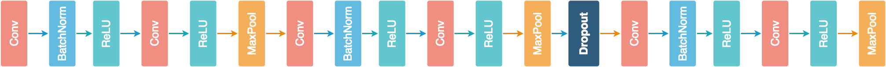
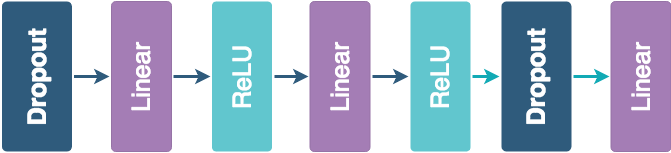

# HW3: Train a deep convolution network on a GPU with PyTorch for the CIFAR10 dataset.

> The convolution network should use (A) dropout, (B) trained with RMSprop or ADAM, and (C) data augmentation.
> 
> For 10% extra credit, compare dropout test accuracy (i) using the heuristic prediction rule and (ii) Monte Carlo simulation.
> 
> For full credit, the model should achieve 80-90% Test Accuracy. Submit via Compass (1) the code and (2) a paragraph (in a PDF document) which reports the results and briefly describes the model architecture.
>
> Due September 28 at 5:00 PM.


## Implementation

### Model Architecture

#### Convolutional Layers




```python
self.conv_layer = nn.Sequential(

    # Conv Layer block 1
    nn.Conv2d(in_channels=3, out_channels=32, kernel_size=3, padding=1),
    nn.BatchNorm2d(32),
    nn.ReLU(inplace=True),
    nn.Conv2d(in_channels=32, out_channels=64, kernel_size=3, padding=1),
    nn.ReLU(inplace=True),
    nn.MaxPool2d(kernel_size=2, stride=2),

    # Conv Layer block 2
    nn.Conv2d(in_channels=64, out_channels=128, kernel_size=3, padding=1),
    nn.BatchNorm2d(128),
    nn.ReLU(inplace=True),
    nn.Conv2d(in_channels=128, out_channels=128, kernel_size=3, padding=1),
    nn.ReLU(inplace=True),
    nn.MaxPool2d(kernel_size=2, stride=2),
    nn.Dropout2d(p=0.05),

    # Conv Layer block 3
    nn.Conv2d(in_channels=128, out_channels=256, kernel_size=3, padding=1),
    nn.BatchNorm2d(256),
    nn.ReLU(inplace=True),
    nn.Conv2d(in_channels=256, out_channels=256, kernel_size=3, padding=1),
    nn.ReLU(inplace=True),
    nn.MaxPool2d(kernel_size=2, stride=2),
)
```


#### Fully Connected Layers




```python
self.fc_layer = nn.Sequential(
    nn.Dropout(p=0.1),
    nn.Linear(4096, 1024),
    nn.ReLU(inplace=True),
    nn.Linear(1024, 512),
    nn.ReLU(inplace=True),
    nn.Dropout(p=0.1),
    nn.Linear(512, 10)
)
```


### Hyper-parameters


|    Hyper-parameters    	|         Description        	|
|:----------------------:	|:--------------------------:	|
|       lr = 0.001       	|        learning rate       	|
|        wd = 5e-4       	|        weight decay        	|
|       epochs = 50      	|       training epochs      	|
| batch\_size_train = 128 	| batch size of training set 	|
|  batch\_size_test = 64  	|   batch size of test set   	|


### Loss function and Optimizer

#### Loss funtion

- [torch.nn.CrossEntropyLoss](https://pytorch.org/docs/stable/nn.html#torch.nn.CrossEntropyLoss)


#### Optimizer

- [torch.optim.RMSprop](https://pytorch.org/docs/stable/optim.html?#torch.optim.RMSprop)
- [torch.optim.Adam](https://pytorch.org/docs/stable/optim.html?#torch.optim.Adam)

### Data Augmentation

```python
transform_train = transforms.Compose([
    transforms.RandomCrop(32, padding=4),
    transforms.RandomHorizontalFlip(),
    transforms.ToTensor(),
    transforms.Normalize((0.4914, 0.4822, 0.4465), (0.2023, 0.1994, 0.2010)),
])

# Normalize the test set same as training set without augmentation
transform_test = transforms.Compose([
    transforms.ToTensor(),
    transforms.Normalize((0.4914, 0.4822, 0.4465), (0.2023, 0.1994, 0.2010)),
])
```

### Result


#### torch.optim.Adam

With Adam Optimizer, in 50 Epochs, I reached 84% ~ 85% accuracy on test set.

```c
$ python3 main.py
==> Data Augmentation ...
==> Preparing CIFAR10 dataset ...
Files already downloaded and verified
Files already downloaded and verified
==> Initialize CNN model ...
==> Building new CNN model ...
==> Start training ...
Iteration: 1 | Loss: 1.5150132923175001 | Training accuracy: 56.916% | Test accuracy: 55.62%
==> Saving model ...
Iteration: 2 | Loss: 1.0681475259154045 | Training accuracy: 65.806% | Test accuracy: 65.71%
Iteration: 3 | Loss: 0.8781394674954817 | Training accuracy: 72.002% | Test accuracy: 68.09%
Iteration: 4 | Loss: 0.7657369798254174 | Training accuracy: 75.442% | Test accuracy: 74.27%
Iteration: 5 | Loss: 0.6928338831495446 | Training accuracy: 78.476% | Test accuracy: 77.28%
Iteration: 6 | Loss: 0.6400617288658991 | Training accuracy: 79.514% | Test accuracy: 77.55%
Iteration: 7 | Loss: 0.5916749586534622 | Training accuracy: 80.572% | Test accuracy: 78.0%
Iteration: 8 | Loss: 0.5629336702091919 | Training accuracy: 81.942% | Test accuracy: 79.65%
Iteration: 9 | Loss: 0.534895096136176 | Training accuracy: 82.888% | Test accuracy: 80.74%
Iteration: 10 | Loss: 0.5094442191483725 | Training accuracy: 84.09% | Test accuracy: 81.1%
Iteration: 11 | Loss: 0.4911502740724617 | Training accuracy: 84.454% | Test accuracy: 80.49%
Iteration: 12 | Loss: 0.47165061491529653 | Training accuracy: 84.668% | Test accuracy: 81.35%
Iteration: 13 | Loss: 0.45937477761064954 | Training accuracy: 85.416% | Test accuracy: 81.92%
Iteration: 14 | Loss: 0.44968167156971933 | Training accuracy: 84.942% | Test accuracy: 81.6%
Iteration: 15 | Loss: 0.43403286450659223 | Training accuracy: 86.026% | Test accuracy: 81.17%
Iteration: 16 | Loss: 0.4290188334863204 | Training accuracy: 86.078% | Test accuracy: 81.39%
Iteration: 17 | Loss: 0.41906910223881605 | Training accuracy: 86.942% | Test accuracy: 83.0%
Iteration: 18 | Loss: 0.3833522180004803 | Training accuracy: 87.782% | Test accuracy: 83.78%
Iteration: 19 | Loss: 0.36290439978584915 | Training accuracy: 87.938% | Test accuracy: 83.99%
Iteration: 20 | Loss: 0.3600675714061693 | Training accuracy: 88.308% | Test accuracy: 83.61%
Iteration: 21 | Loss: 0.35304753722437204 | Training accuracy: 88.604% | Test accuracy: 83.65%
Iteration: 22 | Loss: 0.35058872626565607 | Training accuracy: 88.724% | Test accuracy: 83.7%
Iteration: 23 | Loss: 0.34309560704566633 | Training accuracy: 88.334% | Test accuracy: 83.85%
Iteration: 24 | Loss: 0.3361902222075426 | Training accuracy: 89.46% | Test accuracy: 84.2%
Iteration: 25 | Loss: 0.3339634421460159 | Training accuracy: 88.41% | Test accuracy: 83.24%
Iteration: 26 | Loss: 0.32874407811695355 | Training accuracy: 89.402% | Test accuracy: 84.45%
Iteration: 27 | Loss: 0.3276860989496836 | Training accuracy: 89.31% | Test accuracy: 84.01%
Iteration: 28 | Loss: 0.32246214124705175 | Training accuracy: 89.548% | Test accuracy: 83.81%
Iteration: 29 | Loss: 0.3193482501656198 | Training accuracy: 90.224% | Test accuracy: 84.62%
Iteration: 30 | Loss: 0.3137577373886962 | Training accuracy: 89.948% | Test accuracy: 84.03%
Iteration: 31 | Loss: 0.3102418626741985 | Training accuracy: 89.98% | Test accuracy: 84.64%
Iteration: 32 | Loss: 0.30676858275747665 | Training accuracy: 89.834% | Test accuracy: 84.36%
Iteration: 33 | Loss: 0.3054589622694513 | Training accuracy: 90.044% | Test accuracy: 84.58%
Iteration: 34 | Loss: 0.30346839354776056 | Training accuracy: 89.932% | Test accuracy: 83.74%
Iteration: 35 | Loss: 0.30111074965933093 | Training accuracy: 90.748% | Test accuracy: 85.13%
Iteration: 36 | Loss: 0.2959785862347049 | Training accuracy: 90.24% | Test accuracy: 83.49%
Iteration: 37 | Loss: 0.2921854796083382 | Training accuracy: 90.958% | Test accuracy: 85.63%
Iteration: 38 | Loss: 0.29025346581893197 | Training accuracy: 91.074% | Test accuracy: 85.14%
Iteration: 39 | Loss: 0.29113843897953057 | Training accuracy: 90.886% | Test accuracy: 85.32%
Iteration: 40 | Loss: 0.28360521976295333 | Training accuracy: 90.016% | Test accuracy: 84.31%
Iteration: 41 | Loss: 0.28354978530913055 | Training accuracy: 90.644% | Test accuracy: 85.01%
Iteration: 42 | Loss: 0.2766315230094563 | Training accuracy: 91.252% | Test accuracy: 85.22%
Iteration: 43 | Loss: 0.2846868697868284 | Training accuracy: 91.206% | Test accuracy: 85.06%
Iteration: 44 | Loss: 0.2699394336403788 | Training accuracy: 91.408% | Test accuracy: 85.33%
Iteration: 45 | Loss: 0.28177465668038637 | Training accuracy: 91.906% | Test accuracy: 85.76%
Iteration: 46 | Loss: 0.2756738036375521 | Training accuracy: 91.722% | Test accuracy: 85.32%
Iteration: 47 | Loss: 0.27103444339369265 | Training accuracy: 90.7% | Test accuracy: 84.69%
Iteration: 48 | Loss: 0.26857548944480586 | Training accuracy: 90.816% | Test accuracy: 84.79%
Iteration: 49 | Loss: 0.2688227419734306 | Training accuracy: 91.46% | Test accuracy: 84.27%
Iteration: 50 | Loss: 0.2649988779402755 | Training accuracy: 91.822% | Test accuracy: 85.09%
```

#### torch.optim.RMSProp

With RMSProp Optimizer, in 50 Epochs, I reached 84% ~ 85% accuracy on test set.

```c
$ python3 main.py
==> Data Augmentation ...
==> Downloading CIFAR10 dataset ...
Files already downloaded and verified
Files already downloaded and verified
==> Initialize CNN model ...
==> Building new CNN model ...
==> Start training ...
[1] loss: 1.798
Accuracy of the network on the test images: 47 %
==>  Saving model..
[2] loss: 1.341
Accuracy of the network on the test images: 56 %
[3] loss: 1.062
Accuracy of the network on the test images: 61 %
[4] loss: 0.886
Accuracy of the network on the test images: 65 %
[5] loss: 0.776
Accuracy of the network on the test images: 73 %
[6] loss: 0.698
Accuracy of the network on the test images: 77 %
[7] loss: 0.641
Accuracy of the network on the test images: 75 %
[8] loss: 0.591
Accuracy of the network on the test images: 78 %
[9] loss: 0.551
Accuracy of the network on the test images: 75 %
[10] loss: 0.521
Accuracy of the network on the test images: 78 %
[11] loss: 0.492
Accuracy of the network on the test images: 80 %
[12] loss: 0.467
Accuracy of the network on the test images: 80 %
[13] loss: 0.449
Accuracy of the network on the test images: 80 %
[14] loss: 0.430
Accuracy of the network on the test images: 81 %
[15] loss: 0.410
Accuracy of the network on the test images: 81 %
[16] loss: 0.396
Accuracy of the network on the test images: 79 %
[17] loss: 0.382
Accuracy of the network on the test images: 82 %
[18] loss: 0.371
Accuracy of the network on the test images: 82 %
[19] loss: 0.357
Accuracy of the network on the test images: 81 %
[20] loss: 0.348
Accuracy of the network on the test images: 80 %
[21] loss: 0.333
Accuracy of the network on the test images: 81 %
[22] loss: 0.327
Accuracy of the network on the test images: 83 %
[23] loss: 0.316
Accuracy of the network on the test images: 83 %
[24] loss: 0.309
Accuracy of the network on the test images: 82 %
[25] loss: 0.299
Accuracy of the network on the test images: 81 %
[26] loss: 0.290
Accuracy of the network on the test images: 82 %
[27] loss: 0.283
Accuracy of the network on the test images: 83 %
[28] loss: 0.278
Accuracy of the network on the test images: 79 %
[29] loss: 0.272
Accuracy of the network on the test images: 83 %
[30] loss: 0.266
Accuracy of the network on the test images: 82 %
[31] loss: 0.260
Accuracy of the network on the test images: 80 %
[32] loss: 0.254
Accuracy of the network on the test images: 84 %
[33] loss: 0.246
Accuracy of the network on the test images: 81 %
[34] loss: 0.244
Accuracy of the network on the test images: 83 %
[35] loss: 0.241
Accuracy of the network on the test images: 82 %
[36] loss: 0.234
Accuracy of the network on the test images: 83 %
[37] loss: 0.234
Accuracy of the network on the test images: 81 %
[38] loss: 0.227
Accuracy of the network on the test images: 83 %
[39] loss: 0.222
Accuracy of the network on the test images: 84 %
[40] loss: 0.218
Accuracy of the network on the test images: 82 %
[41] loss: 0.217
Accuracy of the network on the test images: 85 %
[42] loss: 0.210
Accuracy of the network on the test images: 83 %
[43] loss: 0.209
Accuracy of the network on the test images: 84 %
[44] loss: 0.201
Accuracy of the network on the test images: 83 %
[45] loss: 0.199
Accuracy of the network on the test images: 84 %
[46] loss: 0.197
Accuracy of the network on the test images: 84 %
[47] loss: 0.190
Accuracy of the network on the test images: 82 %
[48] loss: 0.192
Accuracy of the network on the test images: 84 %
[49] loss: 0.189
Accuracy of the network on the test images: 84 %
[50] loss: 0.186
Accuracy of the network on the test images: 81 %
```