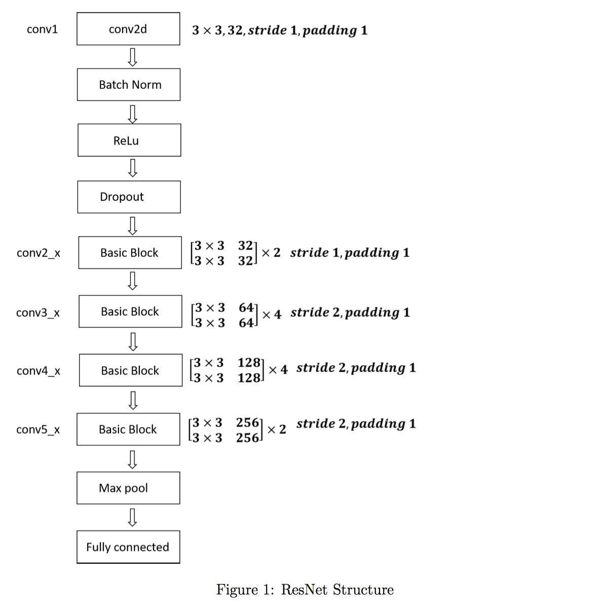
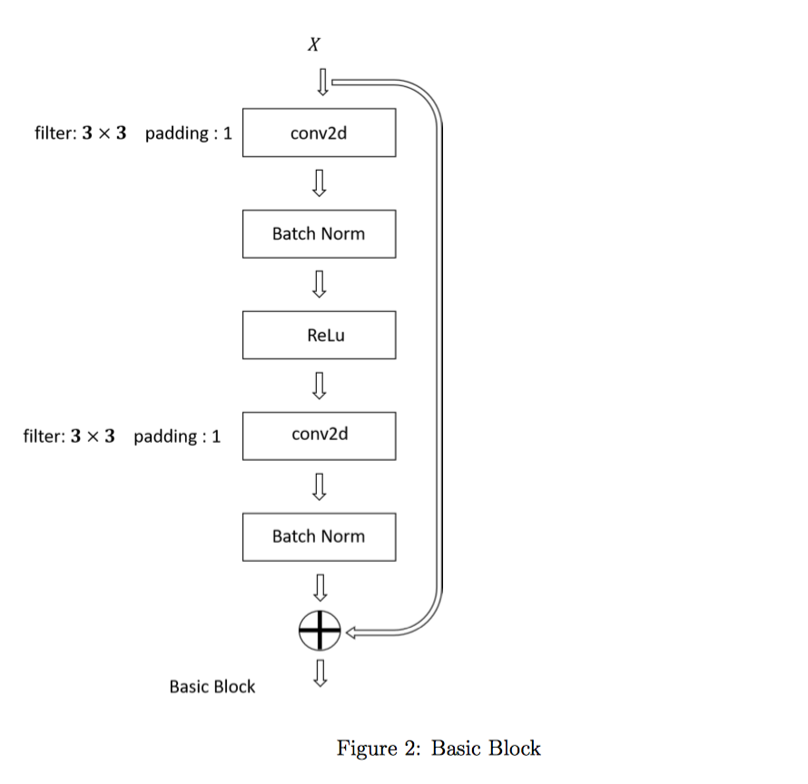

# HW4: Implement a Deep Residual Neural Network for CIFAR100

> Due October 5 at 5:00 PM.


## Residual Networks

You will learn how to build very deep convolutional networks using **Residual Networks (ResNets)**. In theory, deep networks can represent very complex functions. However, in practice, they are difficult to train. Residual Networks, introduced by He et al. (2015), allow for training deeper networks than was previously possible. In this homework assignment, you will implement the basic building blocks of ResNets, and then put together these building blocks to implement and train a deep residual neural network for image classification on the **CIFAR100** dataset via Pytorch. Moreover, in this assignment, you will also learn how to use a pre-trained ResNet (which was trained on the **ImageNet** dataset) and then train it on CIFAR100. This is an example of *transfer learning*.


## Homework Requirements

- Build the Residual Network specified in Figure 1 and achieve at least $60\%$ test accuracy.
    - In the homework, you should define your "**Basic Block**" as shown in Figure 2. For each weight layer, it should contain $ 3 \times 3 $ filters for a specific number of input channels and output channels. The output of a sequence of ResNet basic blocks goes through a max pooling layer with your own choice of filter size, and then goes to a fully-connected layer. The hyperparameter specification for each component is given in figure 1. Note that the notation follows the notation in He et al. (2015).
- fine-tune a pre-trained ResNet-18 model and achieve at least $ 70\% $ test accuracy.


## Dataset and Pre-trained Model

We provide the CIFAR100 in two different formats. The data is located in the following directory:

```
/projects/training/bauh/CIFAR100/Dataset/
```

For the second part of your homework, you need to load the pre-trained model, and it is located in the following directory:

```
/projects/training/bauh/CIFAR100/model/
```

<p align="center">
    
</p>


Copy the pre-trained model file into your code directory and you can load the pre-trained model with the following command


```python
def resnet18(pretrained = True) :

    model = torchvision.models.resnet.ResNet(torchvision.models.resnet.BasicBlock, [2,2,2,2])
    
    if pretrained:
        model.load_state_dict(model_zoo.load_url(model_urls['resnet18'], model_dir = './'))
    return model
```


Note that the input size for the pre-trained model is $224 \times 224$, and you have to up-sample the images in CIFAR100 dataset.

<p align="center">
    
</p>

## Computational Time

For Bluewater users, a reasonable running time for the first part is about **3** hours and the second part is about **3 to 4** hours.


## References

1. Kaiming He, Xiangyu Zhang, Shaoqing Ren, Jian Sun - Deep Residual Learning for Image Recognition (2015)
2. Pytorch torchvision.models [https://pytorch.org/docs/stable/torchvision/models.html](https://pytorch.org/docs/stable/torchvision/models.html)

