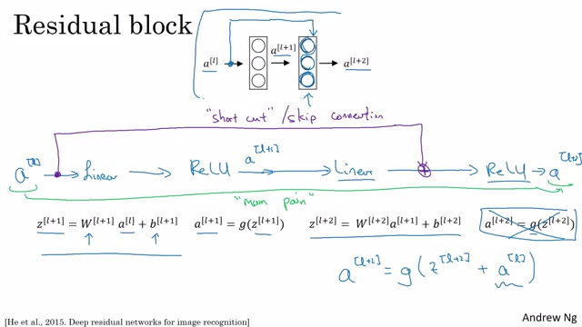

# HW4: Implement a Deep Residual Neural Network for CIFAR100

> Due October 5 at 5:00 PM.

## Part 1

    

### References

[1] Kaiming He, Xiangyu Zhang, Shaoqing Ren, Jian Sun. [*"Deep Residual Learning for Image Recognition"*](https://arxiv.org/abs/1512.03385). arXiv:1512.03385  
[2] Andrew Ng [*"Deep Learning Specialization"*](https://www.youtube.com/watch?v=K0uoBKBQ1gA)  
[3] Source code for [torchvision.models.resnet](https://pytorch.org/docs/0.4.0/_modules/torchvision/models/resnet.html)

## Part 2

Load the pre-trained ResNet-18 model, re-train on CIFAR100 dataset.

    

### References

[1] Pytorch Forum [*"Understanding time difference between finetuning and training the last layer with frozen weights"*](https://discuss.pytorch.org/t/understanding-time-difference-between-finetuning-and-training-the-last-layer-with-frozen-weights/10796)  
[2] Pytorch Tutorial [*"Transfer Learning Tutorial"*](https://pytorch.org/tutorials/beginner/transfer_learning_tutorial.html)  
[3] Pytorch Forum [*"How to perform finetuning in Pytorch?"*](https://discuss.pytorch.org/t/how-to-perform-finetuning-in-pytorch/419)  
[4] Pytorch Tutorial [*"Excluding Subgraphs from backward"*](https://pytorch.org/docs/master/notes/autograd.html#excluding-subgraphs-from-backward)