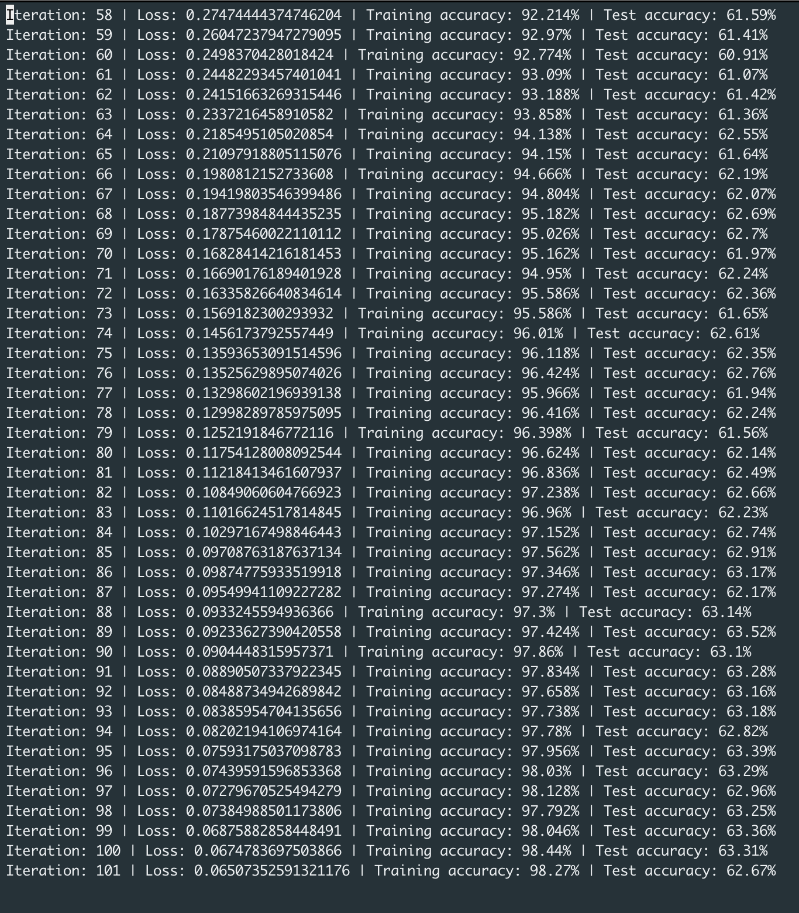

# HW4: Implement a Deep Residual Neural Network for CIFAR100

> Due October 10 at 5:00 PM.


## Part 1

<p align="center">
    
</p>


### Result

<p align="center">
    
</p>

### References

[1] Kaiming He, Xiangyu Zhang, Shaoqing Ren, Jian Sun. [*"Deep Residual Learning for Image Recognition"*](https://arxiv.org/abs/1512.03385). arXiv:1512.03385  
[2] Andrew Ng [*"Deep Learning Specialization"*](https://www.youtube.com/watch?v=K0uoBKBQ1gA)  
[3] Source code for [*torchvision.models.resnet*](https://pytorch.org/docs/0.4.0/_modules/torchvision/models/resnet.html)


## Part 2

Load the pre-trained ResNet-18 model, re-train on CIFAR100 dataset.

<p align="center">
    
</p>

### Result

```
==> Load pre-trained ResNet model ...
==> Data Augmentation ...
==> Preparing CIFAR100 dataset ...
Files already downloaded and verified
Files already downloaded and verified
==> Start training ...
Iteration: 1 | Loss: 3.102943994200138 | Training accuracy: 35.358% | Test accuracy: 42.99%
==> Saving model ...
Iteration: 2 | Loss: 2.40171246303012 | Training accuracy: 42.136% | Test accuracy: 50.52%
Iteration: 3 | Loss: 2.085792493789702 | Training accuracy: 48.434% | Test accuracy: 54.83%
Iteration: 4 | Loss: 1.8882903026802766 | Training accuracy: 52.774% | Test accuracy: 59.63%
Iteration: 5 | Loss: 1.7602971520875117 | Training accuracy: 55.094% | Test accuracy: 60.21%
Iteration: 6 | Loss: 1.6348791982206847 | Training accuracy: 58.04% | Test accuracy: 62.43%
Iteration: 7 | Loss: 1.5522922139490962 | Training accuracy: 60.128% | Test accuracy: 63.67%
Iteration: 8 | Loss: 1.4837936880948293 | Training accuracy: 62.098% | Test accuracy: 64.31%
Iteration: 9 | Loss: 1.4072782235682164 | Training accuracy: 63.582% | Test accuracy: 66.54%
Iteration: 10 | Loss: 1.3392375324593874 | Training accuracy: 64.368% | Test accuracy: 67.82%
Iteration: 11 | Loss: 1.269238745329752 | Training accuracy: 66.144% | Test accuracy: 68.66%
Iteration: 12 | Loss: 1.2129387459374597 | Training accuracy: 67.342% | Test accuracy: 69.45%
Iteration: 13 | Loss: 1.16239485723947592 | Training accuracy: 68.824% | Test accuracy: 70.31%
Iteration: 14 | Loss: 1.16239485723947592 | Training accuracy: 69.583% | Test accuracy: 71.23%
```


### References

[1] Pytorch Forum [*"Understanding time difference between finetuning and training the last layer with frozen weights"*](https://discuss.pytorch.org/t/understanding-time-difference-between-finetuning-and-training-the-last-layer-with-frozen-weights/10796)  
[2] Pytorch Tutorial [*"Transfer Learning Tutorial"*](https://pytorch.org/tutorials/beginner/transfer_learning_tutorial.html)  
[3] Pytorch Forum [*"How to perform finetuning in Pytorch?"*](https://discuss.pytorch.org/t/how-to-perform-finetuning-in-pytorch/419)  
[4] Pytorch Tutorial [*"Excluding Subgraphs from backward"*](https://pytorch.org/docs/master/notes/autograd.html#excluding-subgraphs-from-backward)