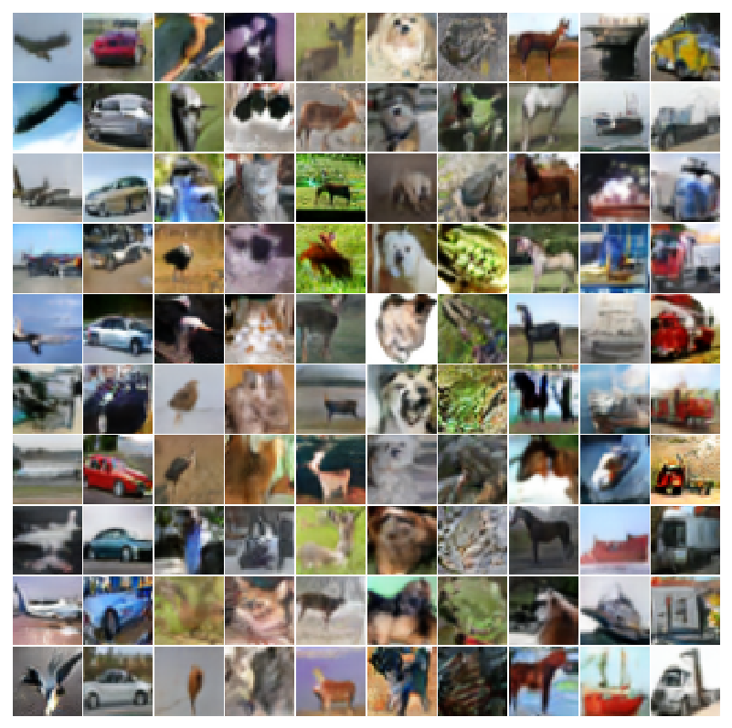
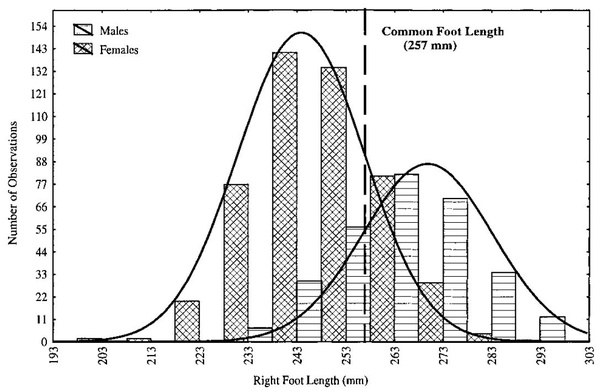
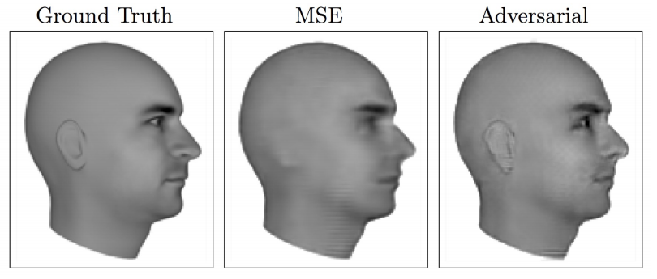
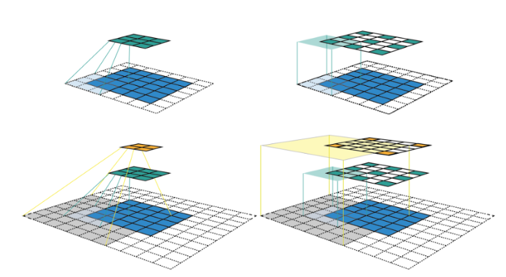
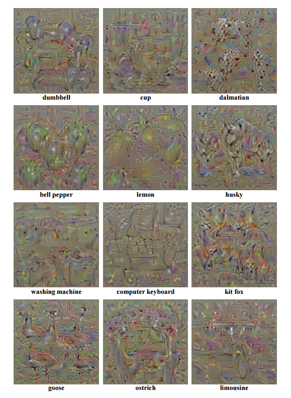
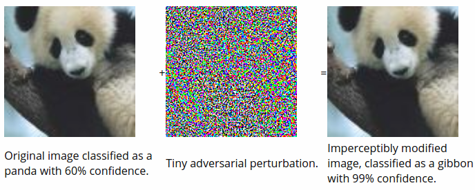
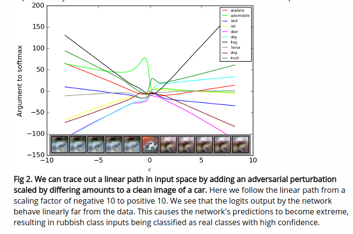
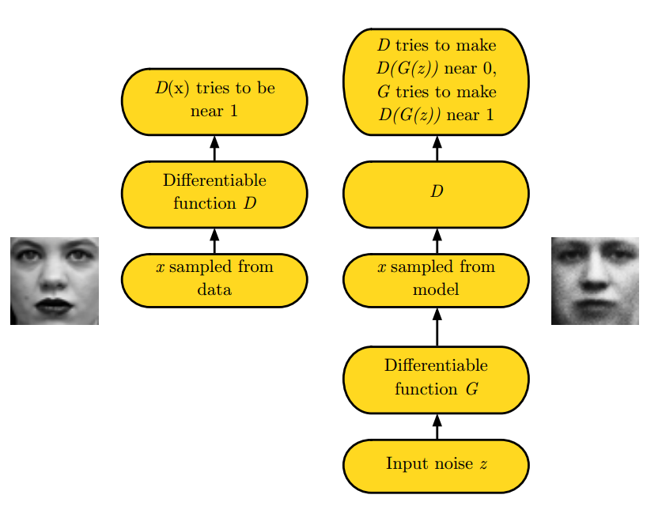
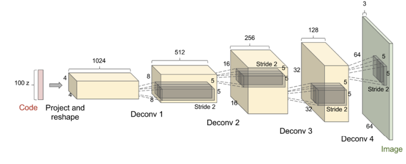
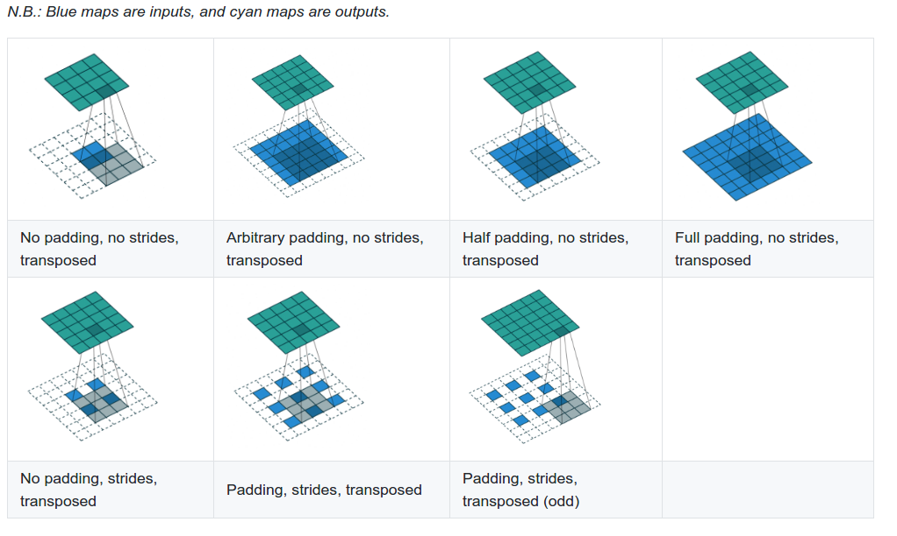

# HW6: Understanding CNNs and Generative Adversarial Networks

> Credited by Logan Courtney, Raj Kataria
>
> Mathjax/Latex is heavily used in this README file. Please download [MathJax Plugin for Github](https://chrome.google.com/webstore/detail/mathjax-plugin-for-github/ioemnmodlmafdkllaclgeombjnmnbima) in order to render Mathjax/Latex in Github correctly.

## Table of contents

- [Overview](#overview)
- [Background](#background)
    - [Discriminative vs Generative Models](#discriminative-vs-generative-models)
    - [Understanding CNNs (What does a CNN actually learn?)](#understanding-cnns-what-does-a-cnn-actually-learn)
    - [Receptive Field](#receptive-field)
    - [Feature Visualization](#feature-visualization)
    - [Tricking Networks](#tricking-networks)
    - [Generative Adversarial Networks (GANs)](#generative-adversarial-networks-gans)
    - [Transposed Convolution](#transposed-convolution)
    - [Auxiliary Classifer GAN (ACGAN)](#auxiliary-classifer-gan-acgan)
    - [Wasserstein GANs](#wasserstein-gans)
    - [Layer Normalization](#layer-normalization)
    - [Leaky ReLU](#leaky-relu)
- [References](#references)

## Overview

The assignment consists of training a Generative Adversarial Network on the CIFAR10 dataset as well as a few visualization tasks for better understanding how a CNN works.

- Train a baseline model for CIFAR10 classification (~2 hours training time)
- Train a discriminator/generator pair on CIFAR10 dataset utilizing techniques from [ACGAN](https://courses.engr.illinois.edu/ie534/fa2018/secure/GAN.html#auxiliary-classifer-gan-acgan) and [Wasserstein GANs](https://courses.engr.illinois.edu/ie534/fa2018/secure/GAN.html#wasserstein-gans) (~30 hours training time)
- Use techniques to create synthetic images maximizing class output scores or particular features as a visualization technique to understand how a CNN is working under the hood (<1 minute)

This homework is slightly different than previous homeworks as you will be provided with a lot of code and sets of hyperparameters. You should only need to train the models once after you piece together the code and understand how it works. The second part of the homework (feature visualization) utilizes the models trained from part 1. The output will need to be run many times with various parameters but the code is extremely fast.

The assignment is written more like a tutorial. The Background section is essentially a written version of the lecture and includes links to reference materials. It is very important to read these.

- Part 1 will take you through the steps to train the necessary models.
- Part 2 will take you through the steps of getting output images which are ultimately what will be turned in for a grade.

Parts 1 and 2 will make frequent references to the background section.

    
     
    <em>Fake images generated from random noise to look like the CIFAR10 dataset. Each column is a class specific generation. Airplane, Car, Bird, Cat, Deer, Dog, Frog, Horse, Ship, Truck</em>

## Background

### Discriminative vs Generative Models

Read the short [wikipedia page](https://en.wikipedia.org/wiki/Generative_model) if you're unfamiliar with these terms

A generative method attempts to model the full joint distribution $P(X,Y)$. For classification problems, we want the posterior probability $P(Y|X)$ which can be gotten from the modeled $P(X,Y)$ with Bayes Rule. In a similar fashion, we can also get the likelihood $P(X|Y)$.

As an example, let $X$ be a random variable for shoe size with $Y$ being a label from `{male,female}`. Shoe size is a multi-modal distribution that can be modeled as two separate Gaussian distributions: one for male and one for female.

    

If provided with a particular shoe size as a classification task, the plot above shows easily how one could estimate $P(Y|X)$. If an application requires it, a generative model could also generate fake data that looks real by sampling from each individual likelihood distribution $P(X|Y)$. As long as the underlying distribution chosen for the modeling the data is correct (two independent Gaussians in this case), the sampled data is indistinguishable from the true data.

Neural networks for classification are trained in a discriminative fashion via SGD to model a pseudo-posterior probability $P(Y|X)$ directly. This is not technically a true distribution although it is very useful in practice since the underlying data distributions are usually of high complexity with many modes. There isn't necessarily a simple distribution like a Gaussian to easily describe it. The network is simply being provided with a large number of data pairs $(X,Y)$ and attempts to learn some mathematical function capable of discriminating between the labels.

What if the application required the generation of realistic samples? By skipping ahead and only modeling $P(Y|X)$, typical classification networks are not directly suited for generating samples matching the joint distribution $P(X,Y)$ or individual likelihoods $P(X|Y)$. Generative Adversarial Netowrks (GANs) are an attempt to capture benefits of generative models while still utilizing the successful techniques used for training discriminative neural networks.

Generative models are useful for things like:

- Representing and manipulating high dimensional probability distributions
- Reinforcement learning applications where the model generates **realistic** experiences to learn from when acquiring data may be costly.
- Unsupervised/Semi-Supervised learning (acquiring unlabeled data is typically easier)
- Capable of handling multi-modal models

    
     
    <em>Lotter, W., Kreiman, G., and Cox, D. (2015). Unsupervised learning of visual structure using predictive generative networks. arXiv preprint arXiv:1511.06380</em>.

The above image is an example of a model attempting to predict the next frame of a 3d rendered moving face. The MSE predicts a *blurry* version of the many possible face positions that could be the next frame. With an additional GAN loss (a discriminator network deciding if it's a ground truth image or from the generator), the generator is forced to choose one of the many possible positions while maintaining the sharp/detailed look of the ground truth.

### Understanding CNNs (What does a CNN actually learn?)

In order generate realistic images with a GAN, it would help to understand a bit more about how CNNs work. For a problem like classification, what does it learn? Does it learn small or large objects? Does it learn larger objects are a collection of smaller parts? Does it have the concept of a *whole*? Consider how one might describe an objects' looks to another person. Would a CNN have a similar description?

There are lot of questions to ask yourself while designing a network (input resolution, how many layers, how many hidden units, when to use pooling/stride, etc.) and there is no definitive answer. It's true that a network will attempt to learn a mapping function from input to output during SGD without user input but the network needs to be capable of learning the appropriate mathematical functions before learning even begins. If the labels can only be discriminated by high resolution, complex patterns taking up large amounts of the input image, using large kernels with significant pooling could inhibit its ability to learn as opposed to a series of small kernel convolutions.

A network trained with SGD is only set up to discriminate between objects. It will not learn what it doesn't need. It can also easily learn patterns in specific images that don't generalize well across samples (overfitting). If your only output classes are a tiger and a soccerball, the network may only need to learn a single kernel capable of detecting orange. It outputs tiger if it sees orange and soccerball otherwise. If you add in a class for basketball, maybe it needs to also learn a straight stripe pattern and a zig zag pattern. Add another class for zebra and it now needs to differentiate between the colors of the stripes. **The intuition follows that the more classes the model needs to discriminate between, the more its necessary for it to learn the concept of a** `whole`. Additionally, with larger datasets, the more the network must use the features it has more efficiently such that there is overlap between classes which can help prevent overfitting.

The features of each layer as the input passes deeper into the network start off as simple patterns (edges, colors, etc.) and become more complex. Due to the nature of convolutions, the receptive field becomes larger allowing the features to become larger in the context of the original input image.

### Receptive Field

The receptive field is the region of the input image that went into the calculation of a particular feature. The output of a convolution layer applied to an image is technically another image. Each pixel in this new image can only see a portion of the previous image. It is easy to see how after applying a kernel of size $3$ would result in a new image where each pixel has a receptive field of $3 \times 3$. A subsequent convolution would result in another image with a receptive field of $5 \times 5$compared to the original input.

    

The image above shows how the receptive field grows when an input image of size $5 \times 5$ gets passed through a convolution layer with a kernel of `3`, padding of `1`, and a stride of `2`. The left column shows the feature maps after each convolution. The right column adds blank spots in to show the stride with the color shaded regions signifying the size of the receptive field.

Convolutions, strided convolutions, and pooling layers affect the receptive field in different ways. Near the output of the network, the receptive field should be relative to the `size` of the objects of interest within the image.

This link here provides a more in depth explanation and is where the above picture is pulled from. It also shows explicit equations for how to calculate the receptive field. This link shows how the receptive field grows as the network gets deeper. The particular network shown in the link is the one you will create for this homework. Note the receptive field is $45 \times 45$ at the output which is larger than the CIFAR10 images ($32 \times 32$). This means the features should be capable of capturing full objects.

### Feature Visualization

It is possible to visualize the features and see how they become more interesting and complex as the network deepens. One method is to input a noisy initialized image and calculate the gradient of a particular feature within the network with respect to the input. This gradient indicates how changes in the input image affect the magnitude of the feature. This process can be repeated with the image being adjusted slightly each time with the gradient. The final image is then a synthesized image causing a very high activation of that particular feature.

    

The above images are generated by backpropagating the error from the final classification layer for particular classes. These images do not look real but there are certain distinctive features. There are sometimes multiple outlines of the various objects, there are clear patterns associated with the objects (dots for the dalmation, squares for the computer keyboard, body outlines for the animals), and the size of the objects vary in terms of receptive field. There are lots of random points/colors/contours that cause high activation but not what we as humans would necessarily think are important.

    

The following link goes much more in depth to this process and has references to a paper/visualization tool. You will do this for the second part of this assignment.

### Tricking Networks

Similar to the feature visualization technique, real images correctly classified by a network can be imperceptibly altered to produce a highly confident incorrect output. Backpropagate the error for an alternative label to real image, use the sign of the gradient (-1 or 1), multiply this by 0.0078, and add it to the original image. A value of 0.0078 is 1⁄255 which is how colors are discretized for storing a digital image. Changing the value of the input image by less than this is imperceptible to humans but convolution networks can be highly sensitive to these changes.

    
    

The above images are from this [blog post](https://www.kdnuggets.com/2015/07/deep-learning-adversarial-examples-misconceptions.html) written by the author of the original GAN paper, Ian Goodfellow.

### Generative Adversarial Networks (GANs)

It is heavily recommended to read the original GAN [tutorial](https://arxiv.org/pdf/1701.00160.pdf) written by Ian Goodfellow as part of the assignment.

GANs consist of two separate networks typically referred to as the generator network and the discriminator network (refered to as the critic network in the Wasserstein GAN paper). The generator is capable of creating fake images from random noise. The discriminator is optimized to differentiate between real images and the images from the generator. The generator is provided with the gradient from the discriminator and is optimized to create fake images the discriminator considers real.

    

The discriminator is simply any convolutional neural network such as the ones used in previous assignments. The generator samples a vector from a random distribution and manipulates it with transposed convolutions until it is in the shape of an input image.

    

The above image is from the paper Unsupervised Representation Learning with Deep Convolutional Generative Advserial Networks and is typically referred to as DCGAN for short. Although they're labeled as deconvolutions, the correct name is a transposed convolution as a deconvolution technically means the inverse of a convolution. The term deconvolution is sometimes seen in the literature.

### Transposed Convolution

    

When a transposed convolution is used with a stride larger than 1, the output image is increases in size (bottom row of the above image). Animations for the above images can be found here as well as a [technical document](https://arxiv.org/pdf/1603.07285.pdf) about convolutions. Transposed convolutions are discussed in chapter 4.

### Auxiliary Classifer GAN (ACGAN)

The original GAN formulation was used for unsupervised learning and did not take into account any labels for the data. The final output from the discriminator was of dimension 1 representing the probability of the input being real. [Conditional Image Synthesis with Auxiliary Classifier GANs](https://arxiv.org/pdf/1610.09585.pdf) introduced a technique for generating class specific examples by including an auxiliary classifier in the discriminator.

    

There are two primary distinctions. The first is the generator is provided with some information about the class label. When randomly generating a vector of length $d$ for the generator, the first $n$ dimensions (where $n$ is the number of classes) are made to be $0.0$ except for a $1.0$ in the location of a randomly sampled class. Additionally, the discriminator has two separate output layers. The first is used as the critic for determining if the input is real or fake. The second is called the auxiliary classifier and has an output dimension equal to $n$ which determines which class the input belongs to. During optimization, both the generator and the discriminator have an additional loss term which is simply the cross entropy error of the auxiliary classifier.

After training, this provides the additional benefit of being able to specify which class the generator should generate by placing a $1.0$ in one of the first $n$ dimensions of the randomly sampled vector.

### Wasserstein GANs

The original GAN formulation had issues with training stability and the Wasserstein GAN helped address this problem. The Wasserstein GAN optimizes a different loss function. From an implementation standpoint, the only two changes are to remove the sigmoid operation from the final layer to directly be used for optimization and to introduce weight clipping to satisfy the Lipschitz constraint.

[Improved Training for Wasserstein GANs](https://arxiv.org/pdf/1704.00028.pdf) found that weight clipping to enforce the Lipschitz constraint still led to undesired behavior. They penalize the norm of the gradient of the critic (discriminator) with the respect to its input to enforce the constraint instead with significantly improved results.

Batch normalization is typically used in both the generator and the discriminator networks. However, batch normalization causes the entire batch of outputs to be dependent on the entire batch of inputs which makes the gradient penalty invalid. Layer normalization is used as a replacement.

### Layer Normalization

[Layer Normalization](https://arxiv.org/pdf/1607.06450.pdf) attempted to address certain issues related to applying batch normalization to recurrent neural networks and to remove the batch dependencies between the input and output.

Let $X$ be a data matrix of size $b$ by $d$ where $b$ is the batch size and $d$ is the number of features. Each row of this matrix is a separate sample of features. Each column is a single feature over the entire batch. Batch normalization normalizes with respect to the columns while layer normalization normalizes with respect to the row. Therefore, with layer normalization, the features of a single sample are normalized based on all of the other features in that sample without any information about other samples in the batch. This means the output from layer normalization is the same during the training and test phase.

### Leaky ReLU

It is typically easier to train GANs when a leaky ReLU is used in place of all ReLU activations in the discriminator. A leaky ReLU still allows gradient flow (albeit scaled down) even if the output is negative. 

    

