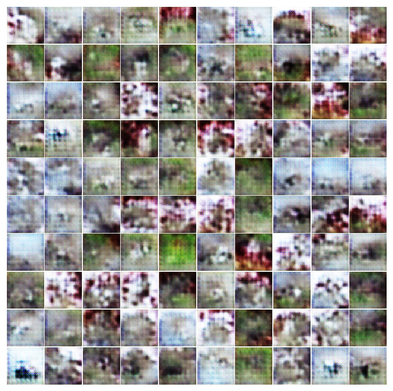
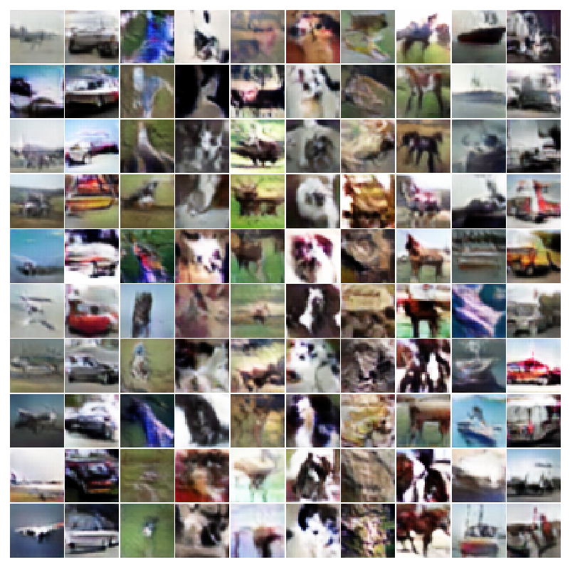
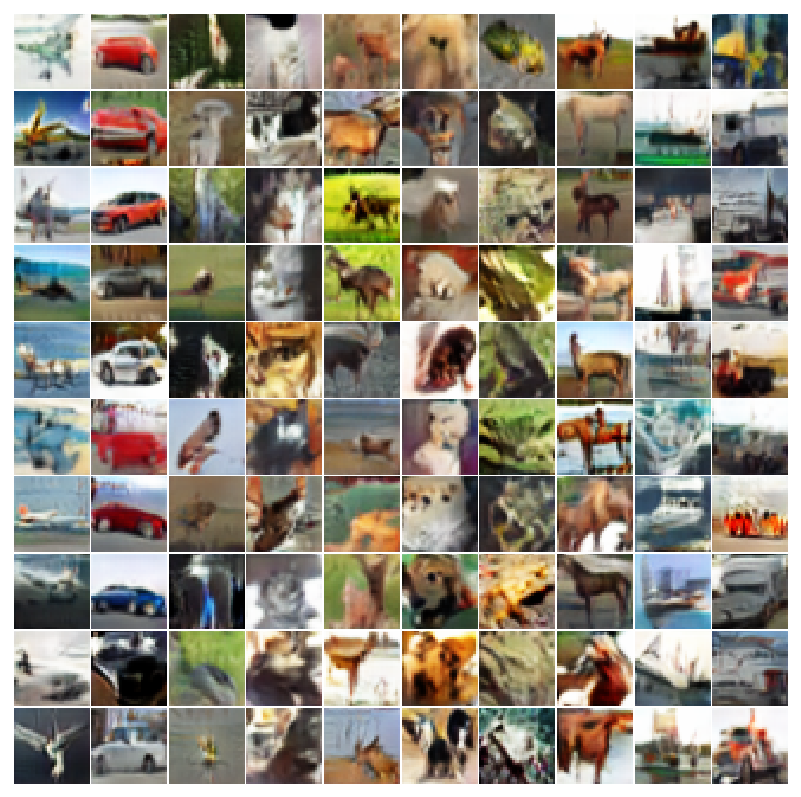
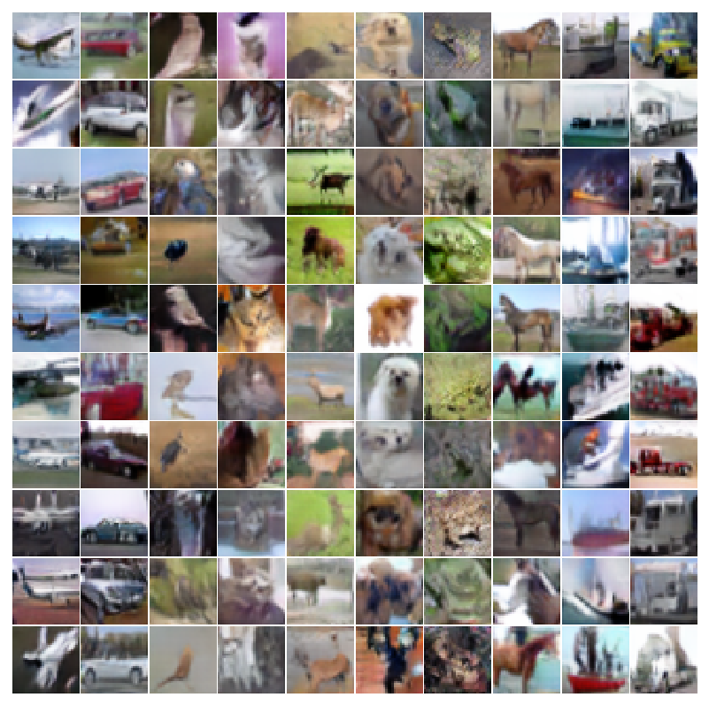

# Part 1 - Training a GAN on CIFAR10

## Defining the Generator and Discriminator


|  name 	|  type  	| input_channels 	| output_channels 	| ksize 	| padding 	| stride 	| input 	| output 	|
|:-----:	|:------:	|:--------------:	|:---------------:	|:-----:	|:-------:	|:------:	|:-----:	|:------:	|
| conv1 	| conv2d 	|        3       	|       196       	|   3   	|    1    	|    1   	| 32x32 	|  32x32 	|
| conv2 	| conv2d 	|       196      	|       196       	|   3   	|    1    	|    2   	| 32x32 	|  16x16 	|
| conv3 	| conv2d 	|       196      	|       196       	|   3   	|    1    	|    1   	| 16x16 	|  16x16 	|
| conv4 	| conv2d 	|       196      	|       196       	|   3   	|    1    	|    2   	| 16x16 	|   8x8  	|
| conv5 	| conv2d 	|       196      	|       196       	|   3   	|    1    	|    1   	|  8x8  	|   8x8  	|
| conv6 	| conv2d 	|       196      	|       196       	|   3   	|    1    	|    1   	|  8x8  	|   8x8  	|
| conv7 	| conv2d 	|       196      	|       196       	|   3   	|    1    	|    1   	|  8x8  	|   8x8  	|
| conv8 	| conv2d 	|       196      	|       196       	|   3   	|    1    	|    2   	|  8x8  	|   4x4  	|
|  pool 	|  max2d 	|                	|                 	|   4   	|    0    	|    4   	|  4x4  	|   1x1  	|
|  fc1  	| linear 	|       196      	|        1        	|       	|         	|        	|       	|        	|
|  fc10 	| linear 	|       196      	|        10       	|       	|         	|        	|       	|        	|


Use the table above to create a PyTorch model for the discriminator. This is similar to classification networks created in previous homeworks. Use Layer Normalization after every convolution operation followed by a Leaky ReLU. There are built in PyTorch implementations for both of these. Unlike batch normalization, layer normalization needs the width and height of its input as well as the number of features. Notice there are two fully connected layers. Both have the same input (the output from the pool operation). fc1 is considered the output of the *critic* which is a score determining of the input is real or a fake image coming from the generator. fc10 is considered the auxiliary classifier which corresponds to the class label. Return both of these outputs in the forward call.


|  name 	|       type      	| input_channels 	| output_channels 	| ksize 	| padding 	| stride 	| input 	| output 	|
|:-----:	|:---------------:	|:--------------:	|:---------------:	|:-----:	|:-------:	|:------:	|:-----:	|:------:	|
|  fc1  	|      linear     	|   128 (noise)  	|     196x4x4     	|       	|         	|        	|       	|        	|
| conv1 	| convtranspose2d 	|       196      	|       196       	|   4   	|    0    	|    2   	|  4x4  	|   8x8  	|
| conv2 	|      conv2d     	|       196      	|       196       	|   3   	|    1    	|    1   	|  8x8  	|   8x8  	|
| conv3 	|      conv2d     	|       196      	|       196       	|   3   	|    1    	|    1   	|  8x8  	|   8x8  	|
| conv4 	|      conv2d     	|       196      	|       196       	|   3   	|    1    	|    1   	|  8x8  	|   8x8  	|
| conv5 	| convtranspose2d 	|       196      	|       196       	|   4   	|    0    	|    2   	|  8x8  	|  16x16 	|
| conv6 	|      conv2d     	|       196      	|       196       	|   3   	|    1    	|    1   	| 16x16 	|  16x16 	|
| conv7 	| convtranspose2d 	|       196      	|       196       	|   4   	|    0    	|    2   	| 16x16 	|  32x32 	|
| conv8 	|      conv2d     	|       196      	|        3        	|   3   	|    1    	|    1   	| 32x32 	|  32x32 	|


Use the table above to create a PyTorch model for the generator. Unlike the discriminator, ReLU activation functions and batch normalization can be used. Use both of these after every layer except `conv8`. This last layer is outputting a $32 \times 32$ image with $3$ channels representing the RGB channels. This is fake image generating from the $128$ dimensional input noise. During training, the real images will be scaled between $-1$ and $1$. Therefore, send the output of `conv8` through a hyperbolic tangent function (`tanh`). Also, take notice the transposed convolution layers. There is a built in PyTorch module for this.


## Train the Discriminator without the Generator

This part is no different than homework 3 except you will need to train the discriminator defined above.


```python
transform_train = transforms.Compose([
    transforms.RandomResizedCrop(32, scale=(0.7, 1.0), ratio=(1.0,1.0)),
    transforms.ColorJitter(
            brightness=0.1*torch.randn(1),
            contrast=0.1*torch.randn(1),
            saturation=0.1*torch.randn(1),
            hue=0.1*torch.randn(1)),
    transforms.RandomHorizontalFlip(),
    transforms.ToTensor(),
    transforms.Normalize((0.5, 0.5, 0.5), (0.5, 0.5, 0.5)),
])

transform_test = transforms.Compose([
    transforms.CenterCrop(32),
    transforms.ToTensor(),
    transforms.Normalize((0.5, 0.5, 0.5), (0.5, 0.5, 0.5)),
])

trainset = torchvision.datasets.CIFAR10(root='./', train=True, download=True, transform=transform_train)
trainloader = torch.utils.data.DataLoader(trainset, batch_size=batch_size, shuffle=True, num_workers=8)

testset = torchvision.datasets.CIFAR10(root='./', train=False, download=False, transform=transform_test)
testloader = torch.utils.data.DataLoader(testset, batch_size=batch_size, shuffle=False, num_workers=8)
```


Use the above code for the train and test loader. Notice the normalize function has mean and std values of $0.5$. The original dataset is scaled between $0$ and $1$. These values will normalize all of the inputs to between $-1$ and $1$ which matches the hyperbolic tangent function from the generator.


```python
model = discriminator()
model.cuda()
criterion = nn.CrossEntropyLoss()
optimizer = torch.optim.Adam(model.parameters(), lr=0.0001)
```


Create a train and test loop as done in homework 3. I trained the model for $100$ epochs with a batch size of $128$ and dropped the learning rate at epochs $50$ and $75$. Make sure the model outputs the train/test accuracy so you can report it later. It should achieve between $87\% \sim89\%$ on the test set.


```python
if(epoch == 50):
    for param_group in optimizer.param_groups:
        param_group['lr'] = learning_rate/10.0
if(epoch == 75):
    for param_group in optimizer.param_groups:
        param_group['lr'] = learning_rate/100.0
```


Depending on how you set up the return function in the discriminator, only use the `fc10` output. The `fc1` output can be ignored for now.


```python
for batch_idx, (X_train_batch, Y_train_batch) in enumerate(trainloader):

    if(Y_train_batch.shape[0] < batch_size):
        continue

    X_train_batch = Variable(X_train_batch).cuda()
    Y_train_batch = Variable(Y_train_batch).cuda()
    _, output = model(X_train_batch)

    loss = criterion(output, Y_train_batch)
    optimizer.zero_grad()

    loss.backward()
    optimizer.step()
```


Lastly, make sure to save the model after training. This will be used later in Part 2.

```python
torch.save(model,'cifar10.model')
```


## Train the Discriminator with the Generator

Training a GAN takes significantly longer than training just the discriminator. For each iteration, you will need to update the generator network and the discriminator network separately. The generator network requires a forward/backward pass through both the generator and the discriminator. The discriminator network requires a forward pass through the generator and two forward/backward passes for the discriminator (one for real images and one for fake images). On top of this, the model can be trained for a large number of iterations. I trained for $500$ epochs.


```python
def calc_gradient_penalty(netD, real_data, fake_data):
    DIM = 32
    LAMBDA = 10
    alpha = torch.rand(batch_size, 1)
    alpha = alpha.expand(batch_size, int(real_data.nelement()/batch_size)).contiguous()
    alpha = alpha.view(batch_size, 3, DIM, DIM)
    alpha = alpha.cuda()
    
    fake_data = fake_data.view(batch_size, 3, DIM, DIM)
    interpolates = alpha * real_data.detach() + ((1 - alpha) * fake_data.detach())

    interpolates = interpolates.cuda()
    interpolates.requires_grad_(True)

    disc_interpolates, _ = netD(interpolates)

    gradients = autograd.grad(outputs=disc_interpolates, inputs=interpolates,
                              grad_outputs=torch.ones(disc_interpolates.size()).cuda(),
                              create_graph=True, retain_graph=True, only_inputs=True)[0]

    gradients = gradients.view(gradients.size(0), -1)                              
    gradient_penalty = ((gradients.norm(2, dim=1) - 1) ** 2).mean() * LAMBDA
    return gradient_penalty
```


The above function is the gradient penalty described in the `Wasserstein GAN` section. Notice once again that only the fc1 output is used instead of the `fc10` output. The returned gradient penalty will be used in the discriminator loss during optimization.


```python
import matplotlib.pyplot as plt
import matplotlib.gridspec as gridspec

def plot(samples):
    fig = plt.figure(figsize=(10, 10))
    gs = gridspec.GridSpec(10, 10)
    gs.update(wspace=0.02, hspace=0.02)

    for i, sample in enumerate(samples):
        ax = plt.subplot(gs[i])
        plt.axis('off')
        ax.set_xticklabels([])
        ax.set_yticklabels([])
        ax.set_aspect('equal')
        plt.imshow(sample)
    return fig
```


This function is used to plot a $10$ by $10$ grid of images scaled between $0$ and 1. After every epoch, we will use a batch of noise saved at the start of training to see how the generator improves over time.


```python
aD =  discriminator()
aD.cuda()

aG = generator()
aG.cuda()

optimizer_g = torch.optim.Adam(aG.parameters(), lr=0.0001, betas=(0,0.9))
optimizer_d = torch.optim.Adam(aD.parameters(), lr=0.0001, betas=(0,0.9))

criterion = nn.CrossEntropyLoss()
```


Create the two networks and an optimizer for each. Note the non-default beta parameters. The first moment decay rate is set to 0. This seems to help stabilize training.


```python
np.random.seed(352)
label = np.asarray(list(range(10))*10)
noise = np.random.normal(0,1,(100,n_z))
label_onehot = np.zeros((100,n_classes))
label_onehot[np.arange(100), label] = 1
noise[np.arange(100), :n_classes] = label_onehot[np.arange(100)]
noise = noise.astype(np.float32)

save_noise = torch.from_numpy(noise)
save_noise = Variable(save_noise).cuda()
```


This is a random batch of noise for the generator. $n_z$ is set to $128$ since this is the expected input for the generator. The noise is not entirely random as it follows the scheme described in section ACGAN. This creates an array label which is the repeated sequence 0-9 ten different times. This means the batch size is $100$ and there are $10$ examples for each class. The first 10 dimensions of the $128$ dimension noise are set to be the `one-hot` representation of the label. This means a $0$ is used in all spots except the index corresponding to a label where a $1$ is located.


```python
start_time = time.time()

# Train the model
for epoch in range(0,num_epochs):

    aG.train()
    aD.train()
    for batch_idx, (X_train_batch, Y_train_batch) in enumerate(trainloader):

        if(Y_train_batch.shape[0] < batch_size):
            continue
```


It is necessary to put the generator into train mode since it uses batch normalization. Technically the discriminator has no dropout or layer normalization meaning train mode should return the same values as test mode. However, it is good practice to keep it here in case you were to add dropout to the discriminator (which can improve results when training GANs).


```python
# train G
if batch_idx % gen_train == 0:
    for p in aD.parameters():
        p.requires_grad_(False)

    aG.zero_grad()

    label = np.random.randint(0,n_classes,batch_size)
    noise = np.random.normal(0,1,(batch_size,n_z))
    label_onehot = np.zeros((batch_size,n_classes))
    label_onehot[np.arange(batch_size), label] = 1
    noise[np.arange(batch_size), :n_classes] = label_onehot[np.arange(batch_size)]
    noise = noise.astype(np.float32)
    noise = torch.from_numpy(noise)
    noise = Variable(noise).cuda()
    fake_label = Variable(torch.from_numpy(label)).cuda()

    fake_data = aG(noise)
    gen_source, gen_class = aD(fake_data)

    gen_source = gen_source.mean()
    gen_class = criterion(gen_class, fake_label)

    gen_cost = -gen_source + gen_class
    gen_cost.backward()

    optimizer_g.step()
```


The first portion of each iteration is for training the generator. Note the first `if()` statement. I set gen_train equal to `1` meaning the generator is trained every iteration just like the discriminator. Sometimes the discriminator is trained more frequently than the generator meaning `gen_train` can be set to something like 5. This seemed to matter more to stabilize training before the Wasserstein GAN loss function started getting used.

The gradients for the discriminator parameters are turned off during the generator update as this saves GPU memory. Random noise is generated along with random labels to modify the noise. `fake_data` are the fake images coming from the generator. The discriminator provides two outputs: one from `fc1` and one from `fc10`. The gen_source is the value from `fc1` specifying if the discriminator thinks its input is real or fake. The discriminator wants this to be positive for real images and negative for fake images. Because of this, the generator wants to maximize this value (hence the negative since in the line calculating gen_cost). The gen_class output is from fc10 specifying which class the discriminator thinks the image is. Even though these are fake images, the noise contains a segment based on the label we want the generator to generate. Therefore, we combine these losses, perform a backward step, and update the parameters.


```python
# train D
for p in aD.parameters():
    p.requires_grad_(True)

aD.zero_grad()

# train discriminator with input from generator
label = np.random.randint(0,n_classes,batch_size)
noise = np.random.normal(0,1,(batch_size,n_z))
label_onehot = np.zeros((batch_size,n_classes))
label_onehot[np.arange(batch_size), label] = 1
noise[np.arange(batch_size), :n_classes] = label_onehot[np.arange(batch_size)]
noise = noise.astype(np.float32)
noise = torch.from_numpy(noise)
noise = Variable(noise).cuda()
fake_label = Variable(torch.from_numpy(label)).cuda()
with torch.no_grad():
    fake_data = aG(noise)

disc_fake_source, disc_fake_class = aD(fake_data)

disc_fake_source = disc_fake_source.mean()
disc_fake_class = criterion(disc_fake_class, fake_label)

# train discriminator with input from the discriminator
real_data = Variable(X_train_batch).cuda()
real_label = Variable(Y_train_batch).cuda()

disc_real_source, disc_real_class = aD(real_data)

prediction = disc_real_class.data.max(1)[1]
accuracy = ( float( prediction.eq(real_label.data).sum() ) /float(batch_size))*100.0

disc_real_source = disc_real_source.mean()
disc_real_class = criterion(disc_real_class, real_label)

gradient_penalty = calc_gradient_penalty(aD,real_data,fake_data)

# disc_cost = disc_fake_source - disc_real_source + disc_real_class + disc_fake_class + gradient_penalty
disc_cost = disc_fake_source - disc_real_source + gradient_penalty + disc_real_class
disc_cost.backward()

optimizer_d.step()
```


The discriminator is being trained on two separate batches of data. The first is on fake data coming from the generator. The second is on the real data. Lastly, the gradient penalty function is called based on the real and fake data. This results in $5$ separate terms for the loss function.


```python
disc_cost = disc_fake_source - disc_real_source + disc_real_class + disc_fake_class + gradient_penalty
```

The `_source` losses are for the Wasserstein GAN formulation. The discriminator is trying to maximize the scores for the real data and minimize the scores for the fake data. The `_class` losses are for the auxiliary classifier wanting to correctly identify the class regardless of if the data is real or fake. I removed `disc_fake_class` from the total cost because it seemed to stabilize training and I didn't think it was necessary (it still works without it). Realistically, it might've simply been that adding all five loss terms created a large gradient and I only needed to scale the learning rate. Ultimately, I used the following:


```python
disc_cost = disc_fake_source - disc_real_source + gradient_penalty + disc_real_class
```

During training, there are multiple values to print out and monitor.


```python
# before epoch training loop starts
loss1 = []
loss2 = []
loss3 = []
loss4 = []
loss5 = []
acc1 = []
```

```python
# within the training loop
loss1.append(gradient_penalty.item())
loss2.append(disc_fake_source.item())
loss3.append(disc_real_source.item())
loss4.append(disc_real_class.item())
loss5.append(disc_fake_class.item())
acc1.append(accuracy)
if((batch_idx%50) == 0):
    print(epoch, batch_idx, "%.2f" % np.mean(loss1), 
                            "%.2f" % np.mean(loss2), 
                            "%.2f" % np.mean(loss3), 
                            "%.2f" % np.mean(loss4), 
                            "%.2f" % np.mean(loss5), 
                            "%.2f" % np.mean(acc1))
```


As mentioned previously, the discriminator is trying to minimize `disc_fake_source` and maximize `disc_real_source`. The generator is trying to maximize `disc_fake_source`. The output from `fc1` is unbounded meaning it may not necessarily hover around $0$ with negative values indicating a fake image and positive values indicating a positive image. It is possible for this value to always be negative or always be positive. The more important value is the difference between them on average. This could be used to determine a threshold for the discriminator considers to be real or fake.


```python
# Test the model
aD.eval()
with torch.no_grad():
    test_accu = []
    for batch_idx, (X_test_batch, Y_test_batch) in enumerate(testloader):
        X_test_batch, Y_test_batch= Variable(X_test_batch).cuda(),Variable(Y_test_batch).cuda()

        with torch.no_grad():
            _, output = aD(X_test_batch)

        prediction = output.data.max(1)[1] # first column has actual prob.
        accuracy = ( float( prediction.eq(Y_test_batch.data).sum() ) /float(batch_size))*100.0
        test_accu.append(accuracy)
        accuracy_test = np.mean(test_accu)
print('Testing',accuracy_test, time.time()-start_time)
```


We should also report the test accuracy after each epoch


```python
# save output
with torch.no_grad():
    aG.eval()
    samples = aG(save_noise)
    samples = samples.data.cpu().numpy()
    samples += 1.0
    samples /= 2.0
    samples = samples.transpose(0,2,3,1)
    aG.train()

fig = plot(samples)
plt.savefig('output/%s.png' % str(epoch).zfill(3), bbox_inches='tight')
plt.close(fig)

if(((epoch+1)%1)==0):
    torch.save(aG,'tempG.model')
    torch.save(aD,'tempD.model')
```


After every epoch, the save_noise created before training can be used to generate samples to see how the generator improves over time. The samples from the generator are scaled between $-1$ and $1$. The plot function expects them to be scaled between $0$ and $1$ and also expects the order of the channels to be `(batch_size, w, h, 3)` as opposed to how PyTorch expects it. Make sure to create the `output/directory` before running your code.


```python
torch.save(aG, 'generator.model')
torch.save(aD, 'discriminator.model')
```


**Save your model to be used in part 2.**

As the model trains, it's possible to scp the generated images back over to your computer to view. Each column should slowly start to resemble a different class.

In order: Airplane, Car, Bird, Cat, Deer, Dog, Frog, Horse, Ship, Truck


|   Epoch   	|      Generated images      	|
|:---------:	|:--------------------------:	|
|  Epoch 0  	|  	|
|  Epoch 20 	|  	|
|  Epoch 80 	|  	|
| Epoch 200 	|  	|


Final generated images


