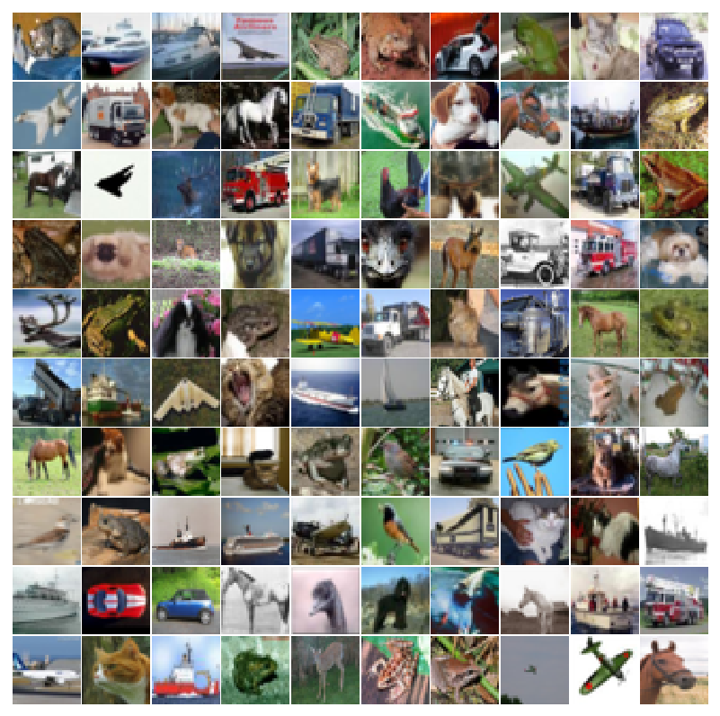
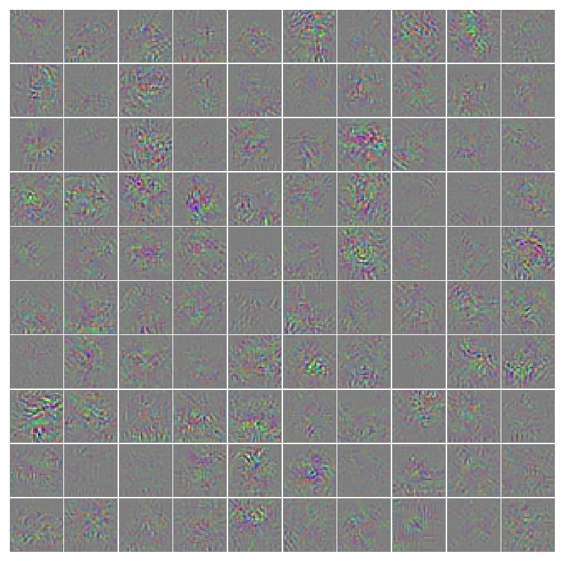
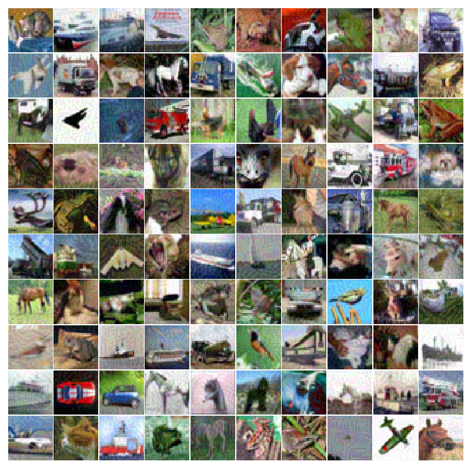
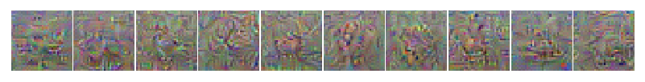
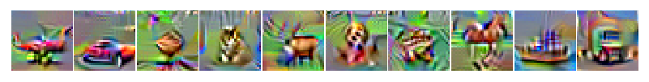

# Part 2 - Visualization

## Perturb Real Images

This first part is following the technique mentioned in Tricking Networks

Use the same plot function from the previous section and load your discriminator model trained without the generator.


```python
transform_test = transforms.Compose([
    transforms.CenterCrop(32),
    transforms.ToTensor(),
    transforms.Normalize((0.5, 0.5, 0.5), (0.5, 0.5, 0.5)),
])

testset = torchvision.datasets.CIFAR10(root='./', train=False, download=False, transform=transform_test)
testloader = torch.utils.data.DataLoader(testset, batch_size=batch_size, shuffle=False, num_workers=8)
testloader = enumerate(testloader)

model = torch.load('cifar10.model')
model.cuda()
model.eval()
```

```python
batch_idx, (X_batch, Y_batch) = testloader.next()
X_batch = Variable(X_batch,requires_grad=True).cuda()
Y_batch_alternate = (Y_batch + 1)%10
Y_batch_alternate = Variable(Y_batch_alternate).cuda()
Y_batch = Variable(Y_batch).cuda()
```

Grab a sample batch from the test dataset. Create an alternative label which is simply $+1$ to the true label.


```python
# save real images
samples = X_batch.data.cpu().numpy()
samples += 1.0
samples /= 2.0
samples = samples.transpose(0,2,3,1)

fig = plot(samples[0:100])
plt.savefig('visualization/real_images.png', bbox_inches='tight')
plt.close(fig)
```


Save the first 100 real images. Make sure to create the `visualization/` directory beforehand.


```python
_, output = model(X_batch)
prediction = output.data.max(1)[1] # first column has actual prob.
accuracy = ( float( prediction.eq(Y_batch.data).sum() ) /float(batch_size))*100.0
print(accuracy)
```

Get the output from the fc10 layer and report the classification accuracy.


```python
# slightly jitter all input images
criterion = nn.CrossEntropyLoss(reduce=False)
loss = criterion(output, Y_batch_alternate)

gradients = torch.autograd.grad(outputs=loss, inputs=X_batch,
                          grad_outputs=torch.ones(loss.size()).cuda(),
                          create_graph=True, retain_graph=False, only_inputs=True)[0]

# save gradient jitter
gradient_image = gradients.data.cpu().numpy()
gradient_image = (gradient_image - np.min(gradient_image))/(np.max(gradient_image)-np.min(gradient_image))
gradient_image = gradient_image.transpose(0,2,3,1)
fig = plot(gradient_image[0:100])
plt.savefig('visualization/gradient_image.png', bbox_inches='tight')
plt.close(fig)
```

Calculate the `loss` based on the alternative classes instead of the real `classes.gradients` is this loss backpropagated to the input image representing how a change in the input affects the change in the output class. Scale the gradient image between $0$ and $1$ and save it.


```python
# jitter input image
gradients[gradients>0.0] = 1.0
gradients[gradients<0.0] = -1.0

gain = 8.0
X_batch_modified = X_batch - gain*0.007843137*gradients
X_batch_modified[X_batch_modified>1.0] = 1.0
X_batch_modified[X_batch_modified<-1.0] = -1.0

## evaluate new fake images
_, output = model(X_batch_modified)
prediction = output.data.max(1)[1] # first column has actual prob.
accuracy = ( float( prediction.eq(Y_batch.data).sum() ) /float(batch_size))*100.0
print(accuracy)

## save fake images
samples = X_batch_modified.data.cpu().numpy()
samples += 1.0
samples /= 2.0
samples = samples.transpose(0,2,3,1)

fig = plot(samples[0:100])
plt.savefig('visualization/jittered_images.png', bbox_inches='tight')
plt.close(fig)
```


Modify the gradients to all be magnitude $1.0$ or $-1.0$ and modify the original image. The example above changes each pixel by $10/255$ based on the gradient sign. Evaluate these new image and also save it. You should end up with something similar to below with high accuracy reported on the real images and essentially random guessing for the altered images.


|   real images  	|      	|
|:--------------:	|:--------------------------------------:	|
|    gradients   	|   	|
| altered images 	|  	|


## Synthetic Images Maximizing Classification Output

This section follows the technique described in section Feature Visualization. The loss function for each class will be used to repeatedly modify an image such that it maximizes


```python
X = X_batch.mean(dim=0)
X = X.repeat(10,1,1,1)

Y = torch.arange(10).type(torch.int64)
Y = Variable(Y).cuda()
```

After loading in a model and a batch of images, calculate the mean image and make 10 copies (for the number of classes). Make a unique label for each copy.


```python
lr = 0.1
weight_decay = 0.001
for i in xrange(200):
    _, output = model(X)

    loss = -output[torch.arange(10).type(torch.int64),torch.arange(10).type(torch.int64)]
    gradients = torch.autograd.grad(outputs=loss, inputs=X_mean,
                              grad_outputs=torch.ones(loss.size()).cuda(),
                              create_graph=True, retain_graph=False, only_inputs=True)[0]

    prediction = output.data.max(1)[1] # first column has actual prob.
    accuracy = ( float( prediction.eq(Y.data).sum() ) /float(10.0))*100.0
    print(i,accuracy,-loss)

    X = X - lr*gradients.data - weight_decay*X.data*torch.abs(X.data)
    X[X>1.0] = 1.0
    X[X<-1.0] = -1.0

## save new images
samples = X.data.cpu().numpy()
samples += 1.0
samples /= 2.0
samples = samples.transpose(0,2,3,1)

fig = plot(samples)
plt.savefig('visualization/max_class.png', bbox_inches='tight')
plt.close(fig)
```


The model evaluates the images and extracts the output from the `fc10` layer for each particular class. The gradient is calculated and the original image `X` is modified by this gradient in order to maximize the output. The learning rate, weight decay, and number of iterations can all be changed to produce different images. Perform this step with both models trained in part 1.


<p align="center">
    
    <br>
    <em>Synthetic images maximizing class output for discriminator trained without the generator</em>
</p>


<p align="center">
    
    <br>
    <em>Synthetic images maximizing class output for discriminator trained with the generator</em>
</p>


## Synthetic Features Maximizing Features at Various Layers

You will need to modify the forward function of your discriminator before loading in the model.


```python
def forward(self, x, extract_features=0):
```


Add an additional argument extract_features.


```python
if extract_features == 8:
    h = F.max_pool2d(h,4,4)
    h = h.view(-1, no_of_hidden_units)
    return h
```


Within the forward function add the statement above after a convolution layer (in this particular case, after `conv8`). Make sure to perform max pooling (based on whatever dimensions the feature map from that particular layer has) and flatten the vector.


```python
X = X_batch.mean(dim=0)
X = X.repeat(batch_size,1,1,1)

Y = torch.arange(batch_size).type(torch.int64)
Y = Variable(Y).cuda()

lr = 0.1
weight_decay = 0.001
for i in xrange(200):
    _, output = model(X)

    loss = -output[torch.arange(batch_size).type(torch.int64),torch.arange(batch_size).type(torch.int64)]
    gradients = torch.autograd.grad(outputs=loss, inputs=X_mean,
                              grad_outputs=torch.ones(loss.size()).cuda(),
                              create_graph=True, retain_graph=False, only_inputs=True)[0]

    prediction = output.data.max(1)[1] # first column has actual prob.
    accuracy = ( float( prediction.eq(Y.data).sum() ) /float(batch_size))*100.0
    print(i,accuracy,-loss)

    X = X - lr*gradients.data - weight_decay*X.data*torch.abs(X.data)
    X[X>1.0] = 1.0
    X[X<-1.0] = -1.0

# save new images
samples = X.data.cpu().numpy()
samples += 1.0
samples /= 2.0
samples = samples.transpose(0,2,3,1)

fig = plot(samples[0:100])
plt.savefig('visualization/max_features.png', bbox_inches='tight')
plt.close(fig)
```


Similar to the section above, this will create synthetic images maximizing a particular feature instead of a particular class.